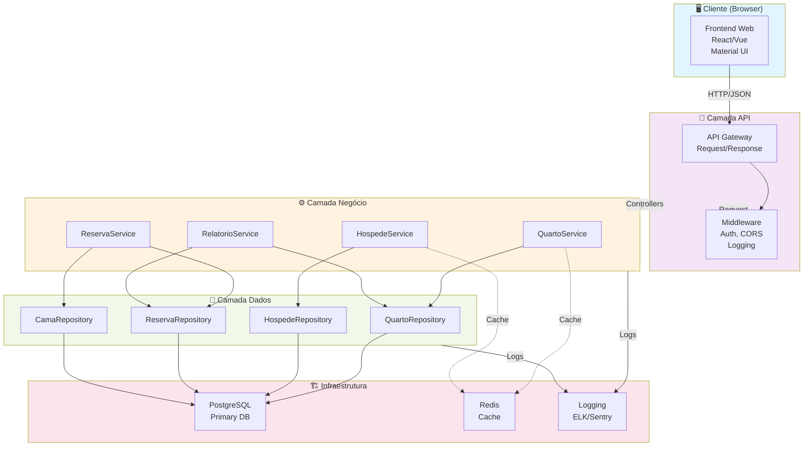
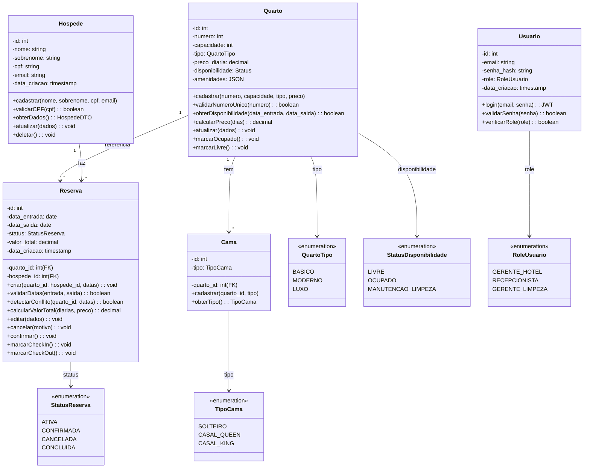
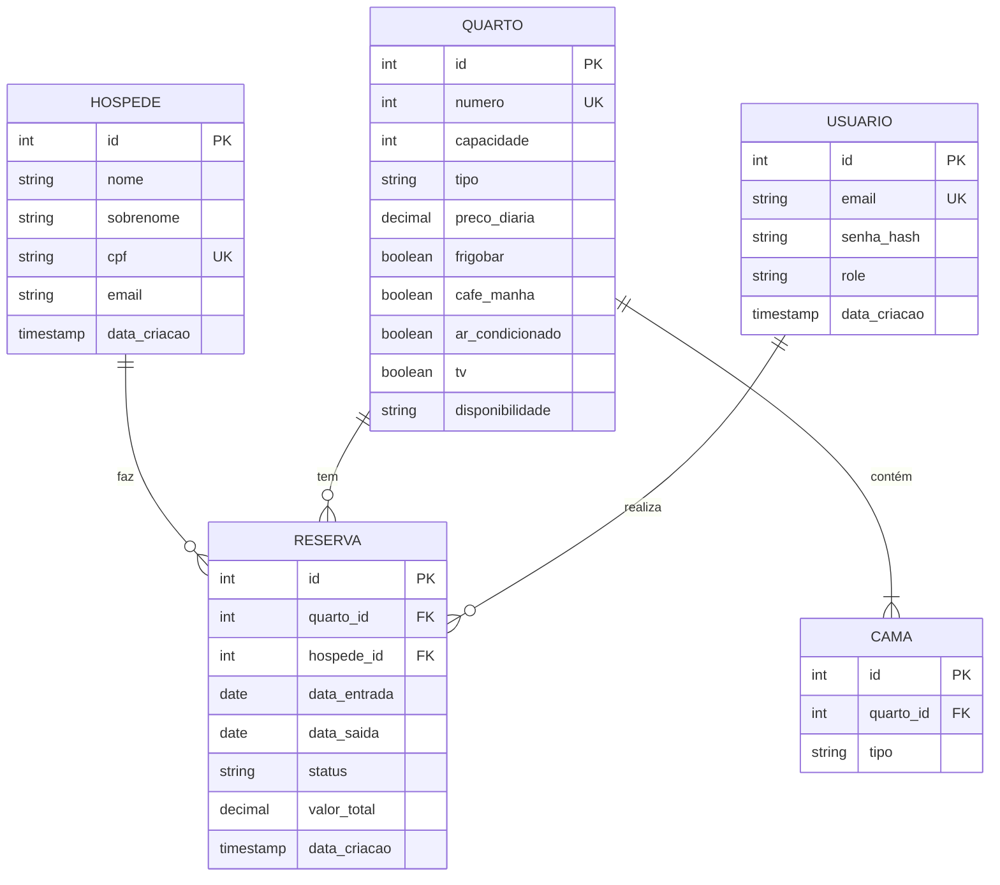
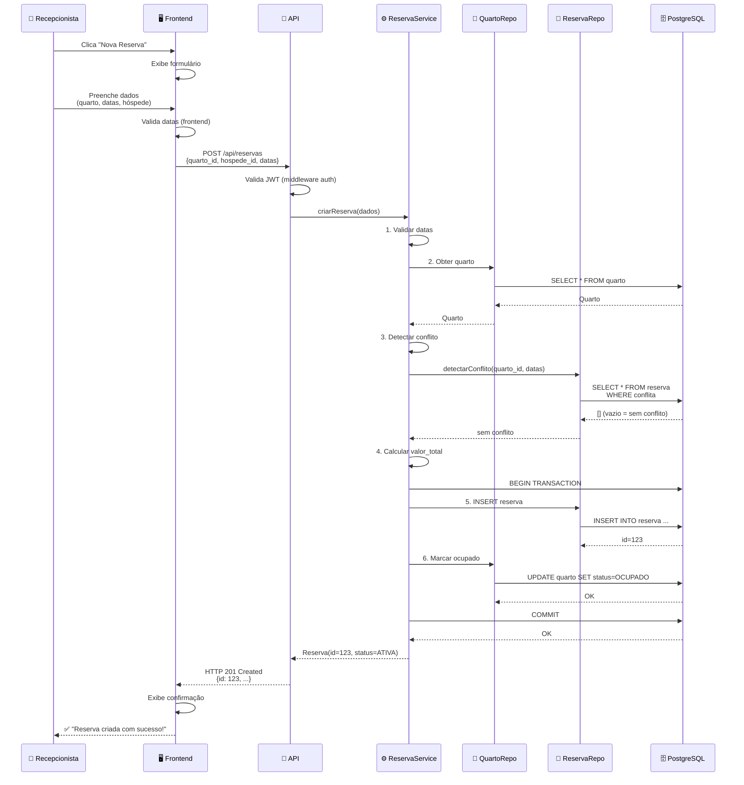
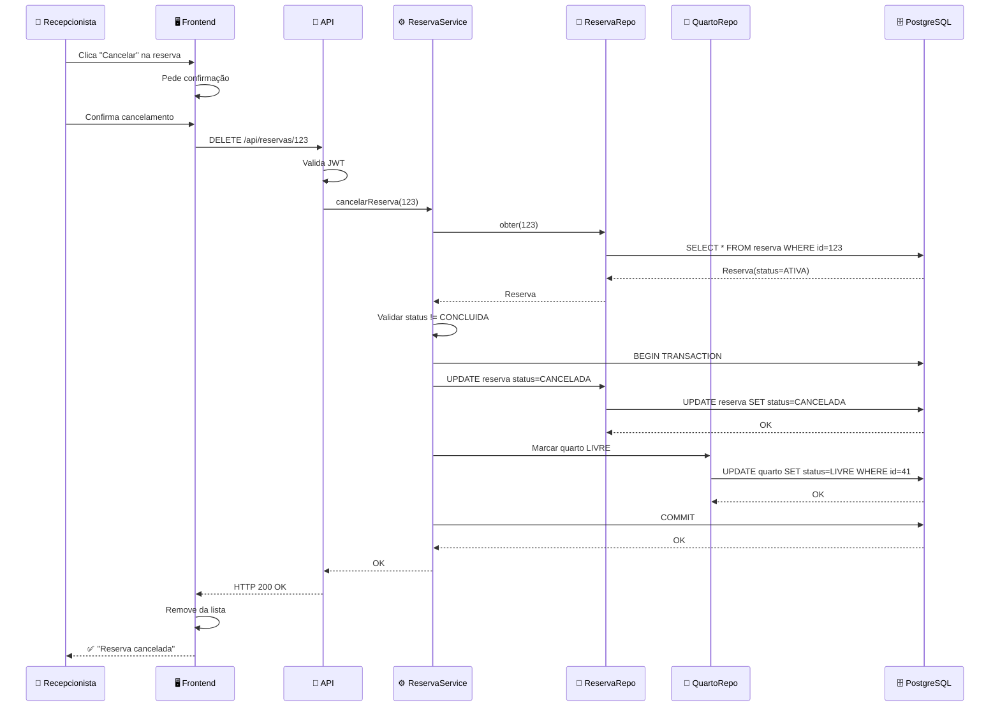

# Diagramas de Componentes e Classes - Sistema de Reserva Hotel

**Versão**: 1.0  
**Data**: 16 de fevereiro de 2026  
**Formato**: Mermaid + UML ASCII

---

## 📐 1. Diagrama de Componentes do Sistema

### 1.1 Arquitetura de Alto Nível



### 1.2 Descrição dos Componentes

#### **Frontend Web (Cliente)**
- **Tecnologia**: React 18+ ou Vue 3+
- **Bibliotecas**: Material-UI, Axios, Redux/Vuex, Jest
- **Responsabilidades**:
  - Renderizar interface com cores verde/azul
  - Validar inputs (UX)
  - Gerenciar estado local
  - Chamar APIs backend
  - Autenticação no cliente (JWT)

#### **API Gateway**
- **Tecnologia**: Express.js middleware
- **Responsabilidades**:
  - Roteamento de requisições
  - Parsing JSON
  - Validação de schema
  - Rate limiting
  - CORS

#### **Middleware**
- **Auth**: Validar JWT, verificar roles
- **Logging**: Winston/Pino, rastrear requisições
- **Error Handler**: Capturar e transformar erros
- **CORS**: Configuração de origens permitidas

#### **Camada de Lógica de Negócio (Services)**

**QuartoService**
- Cadastrar quarto
- Editar quarto
- Listar quartos
- Validar disponibilidade
- Calcular preços

**HospedeService**
- Cadastrar hóspede
- Editar dados hóspede
- Validar CPF
- Listar hóspedes

**ReservaService**
- Criar reserva (com transação)
- Editar reserva
- Cancelar reserva
- Validar datas
- Detectar double-booking

**RelatorioService**
- Gerar relatórios
- Agregações (quartos ocupados, receita)
- Filtros por data
- Export para CSV/PDF

#### **Camada de Acesso a Dados (Repositories)**

**QuartoRepository**
- CRUD de quartos
- Query: quartos disponíveis
- Query: quartos por tipo/preço

**HospedeRepository**
- CRUD de hóspedes
- Query: por CPF
- Query: por email

**ReservaRepository**
- CRUD de reservas
- Query: reservas por quarto/hospede
- Query: conflito de datas
- Suporte a transações

**CamaRepository**
- CRUD de camas
- Query: camas por quarto

#### **Infraestrutura**

**PostgreSQL**
- BD principal
- Transações ACID
- Índices para performance
- Backups automáticos

**Redis (v1.1+)**
- Cache de quartos disponíveis
- Session store distribuído
- Pub/Sub para eventos

**Logging (ELK Stack ou Sentry)**
- Centralizar logs
- Stack traces
- Erro tracking
- Performance monitoring

---

## 👥 2. Diagrama de Classes - Modelo de Dados

### 2.1 Diagrama Mermaid Completo



### 2.2 Tabelas de Entidades

#### **Hospede**

```
┌─────────────────────────────────────────────┐
│ HOSPEDE (Tabela)                            │
├─────────────────────────────────────────────┤
│ id (PK)              │ INT PRIMARY KEY       │
│ nome                 │ VARCHAR(100) NOT NULL │
│ sobrenome            │ VARCHAR(100) NOT NULL │
│ cpf (UNIQUE)         │ VARCHAR(14) NOT NULL  │
│ email                │ VARCHAR(150) NOT NULL │
│ data_criacao         │ TIMESTAMP DEFAULT NOW │
└─────────────────────────────────────────────┘

Índices:
- PRIMARY KEY (id)
- UNIQUE (cpf)
- INDEX (email)
```

**Métodos da Classe Hospede**:
```typescript
class Hospede {
  id: number;
  nome: string;
  sobrenome: string;
  cpf: string;  // XXX.XXX.XXX-XX formato validado
  email: string;
  data_criacao: Date;
  
  // Validações
  static validarCPF(cpf: string): boolean {
    // Validar formato e dígitos verificadores
  }
  
  static validarEmail(email: string): boolean {
    // Validar formato de email
  }
  
  // CRUD
  static criar(dados: CriarHospedeDTO): Hospede {
    // Validar duplicação (CPF)
    // Inserir em BD
    // Retornar instance
  }
  
  static obterPorCPF(cpf: string): Hospede {
    // Query por CPF único
  }
  
  obterDados(): HospedeDTO {
    // Retornar dados sem senha (DTO)
  }
  
  atualizar(dados: EditarHospedeDTO): void {
    // Validar mudanças
    // Atualizar em BD
  }
  
  deletar(): void {
    // Soft delete ou hard delete
    // Verificar referências (reservas)
  }
}
```

---

#### **Quarto**

```
┌──────────────────────────────────────────────────────┐
│ QUARTO (Tabela)                                      │
├──────────────────────────────────────────────────────┤
│ id (PK)              │ INT PRIMARY KEY               │
│ numero (UNIQUE)      │ INT NOT NULL                  │
│ capacidade           │ INT NOT NULL (1-4)            │
│ tipo                 │ ENUM('BASICO','MODERNO','LX') │
│ preco_diaria         │ DECIMAL(10,2) NOT NULL        │
│ frigobar             │ BOOLEAN DEFAULT FALSE          │
│ cafe_manha           │ BOOLEAN DEFAULT FALSE          │
│ ar_condicionado      │ BOOLEAN DEFAULT TRUE           │
│ tv                   │ BOOLEAN DEFAULT TRUE           │
│ disponibilidade      │ ENUM('LIVRE','OCUPADO','ML')  │
│ data_criacao         │ TIMESTAMP DEFAULT NOW          │
└──────────────────────────────────────────────────────┘

Índices:
- PRIMARY KEY (id)
- UNIQUE (numero)
- INDEX (disponibilidade)
- INDEX (tipo)
```

**Métodos da Classe Quarto**:
```typescript
enum QuartoTipo {
  BASICO = 'BASICO',
  MODERNO = 'MODERNO',
  LUXO = 'LUXO'
}

enum StatusDisponibilidade {
  LIVRE = 'LIVRE',
  OCUPADO = 'OCUPADO',
  MANUTENCAO_LIMPEZA = 'MANUTENCAO_LIMPEZA'
}

class Quarto {
  id: number;
  numero: number;  // 101, 102, 201, 202 (único)
  capacidade: number;  // 1-4 pessoas
  tipo: QuartoTipo;
  preco_diaria: decimal;
  amenidades: {
    frigobar: boolean;
    cafe_manha: boolean;
    ar_condicionado: boolean;
    tv: boolean;
  };
  disponibilidade: StatusDisponibilidade = LIVRE;
  camas: Cama[] = [];
  data_criacao: Date;
  
  // Validações
  static validarNumeroUnico(numero: number): boolean {
    // SELECT * FROM quarto WHERE numero = numero
    // Retornar true se disponível
  }
  
  static validarCapacidade(capacidade: number): boolean {
    // 1 <= capacidade <= 4
  }
  
  // CRUD
  static criar(dados: CriarQuartoDTO): Quarto {
    // Validar número único
    // Validar capacidade
    // Inserir em BD
    // Retornar instance
  }
  
  static obterPorNumero(numero: number): Quarto {
    // Query por número único
  }
  
  static listarTodos(): Quarto[] {
    // SELECT * FROM quarto ORDER BY numero
  }
  
  static listarPorTipo(tipo: QuartoTipo): Quarto[] {
    // SELECT * FROM quarto WHERE tipo = tipo
  }
  
  static listarDisponiveis(
    data_entrada: Date,
    data_saida: Date
  ): Quarto[] {
    // Quartos LIVRE que não têm reservas no intervalo
  }
  
  // Disponibilidade
  obterDisponibilidade(
    data_entrada: Date,
    data_saida: Date
  ): boolean {
    // Verificar se há conflito de reservas
    // SELECT * FROM reserva
    // WHERE quarto_id = id
    // AND data_entrada < data_saida
    // AND data_saida > data_entrada
  }
  
  calcularPreco(dias: number): decimal {
    // preco = preco_diaria * dias
    // Possível desconto futuro
  }
  
  marcarOcupado(): void {
    // UPDATE quarto SET disponibilidade = OCUPADO
  }
  
  marcarLivre(): void {
    // UPDATE quarto SET disponibilidade = LIVRE
  }
  
  marcarManutencao(): void {
    // UPDATE quarto SET disponibilidade = MANUTENCAO_LIMPEZA
  }
  
  obterCamas(): Cama[] {
    // SELECT * FROM cama WHERE quarto_id = id
  }
  
  atualizar(dados: EditarQuartoDTO): void {
    // Atualizar campos em BD
  }
}
```

---

#### **Reserva**

```
┌───────────────────────────────────────────────────┐
│ RESERVA (Tabela)                                  │
├───────────────────────────────────────────────────┤
│ id (PK)              │ INT PRIMARY KEY             │
│ quarto_id (FK)       │ INT NOT NULL                │
│ hospede_id (FK)      │ INT NOT NULL                │
│ data_entrada         │ DATE NOT NULL               │
│ data_saida           │ DATE NOT NULL               │
│ status               │ ENUM('ATIVA','CONF','CAN'..│
│ valor_total          │ DECIMAL(10,2) NOT NULL      │
│ data_criacao         │ TIMESTAMP DEFAULT NOW       │
│ data_atualizacao     │ TIMESTAMP DEFAULT NOW       │
└───────────────────────────────────────────────────┘

Foreign Keys:
- quarto_id REFERENCES quarto(id) ON DELETE RESTRICT
- hospede_id REFERENCES hospede(id) ON DELETE RESTRICT

Constraints:
- CHECK (data_entrada < data_saida)
- CHECK (valor_total > 0)

Índices:
- PRIMARY KEY (id)
- INDEX (quarto_id, data_entrada, data_saida)
- INDEX (hospede_id)
- INDEX (status)
- INDEX (data_entrada)
```

**Métodos da Classe Reserva**:
```typescript
enum StatusReserva {
  ATIVA = 'ATIVA',
  CONFIRMADA = 'CONFIRMADA',
  CANCELADA = 'CANCELADA',
  CONCLUIDA = 'CONCLUIDA',
  NO_SHOW = 'NO_SHOW'
}

class Reserva {
  id: number;
  quarto_id: number;  // FK
  hospede_id: number;  // FK
  data_entrada: Date;
  data_saida: Date;
  status: StatusReserva = ATIVA;
  valor_total: decimal;
  data_criacao: Date;
  data_atualizacao: Date;
  
  // Validações
  static validarDatas(
    data_entrada: Date,
    data_saida: Date
  ): boolean {
    // data_entrada < data_saida
    // data_entrada >= hoje
    // Máximo 90 dias adiante (configurable)
  }
  
  static detectarConflito(
    quarto_id: number,
    data_entrada: Date,
    data_saida: Date,
    reserva_id_exclude?: number
  ): boolean {
    // SELECT * FROM reserva
    // WHERE quarto_id = quarto_id
    // AND status IN ('ATIVA', 'CONFIRMADA', 'CHECKIN')
    // AND data_entrada < data_saida
    // AND data_saida > data_entrada
    // AND id != reserva_id_exclude (para edição)
    // Retornar true se há conflito
  }
  
  // CRUD
  static criar(
    quarto_id: number,
    hospede_id: number,
    data_entrada: Date,
    data_saida: Date
  ): Reserva {
    // 1. Validar datas
    // 2. Validar quarto existe
    // 3. Validar hóspede existe
    // 4. Detectar conflito ← CRÍTICO
    // 5. Calcular valor_total
    // 6. BEGIN TRANSACTION
    // 7. INSERT INTO reserva ...
    // 8. UPDATE quarto SET status = OCUPADO
    // 9. COMMIT
    // 10. Retornar instance
  }
  
  static obterPorId(id: number): Reserva {
    // SELECT * FROM reserva WHERE id = id
  }
  
  static listarPorHospede(hospede_id: number): Reserva[] {
    // SELECT * FROM reserva WHERE hospede_id = hospede_id
    // ORDER BY data_entrada DESC
  }
  
  static listarPorQuarto(quarto_id: number): Reserva[] {
    // SELECT * FROM reserva WHERE quarto_id = quarto_id
    // ORDER BY data_entrada DESC
  }
  
  static listarPorPeriodo(
    data_inicio: Date,
    data_fim: Date
  ): Reserva[] {
    // SELECT * FROM reserva
    // WHERE data_entrada >= data_inicio
    // AND data_saida <= data_fim
    // ORDER BY data_entrada
  }
  
  static listarAtivasParaQuarto(
    quarto_id: number
  ): Reserva[] {
    // SELECT * FROM reserva
    // WHERE quarto_id = quarto_id
    // AND status IN ('ATIVA', 'CONFIRMADA')
  }
  
  // Business Logic
  calcularValorTotal(
    quarto: Quarto,
    data_entrada: Date,
    data_saida: Date
  ): decimal {
    const dias = (data_saida - data_entrada).days;
    const preco_base = quarto.calcularPreco(dias);
    // Possível desconto se dias >= 7
    if (dias >= 7) {
      return preco_base * 0.95;  // 5% desconto
    }
    // Possível taxa se fins de semana
    const fins_de_semana = this.contarFinsDeSemana(
      data_entrada,
      data_saida
    );
    if (fins_de_semana > 0) {
      return preco_base * 1.1;  // 10% acréscimo
    }
    return preco_base;
  }
  
  confirmar(): void {
    // UPDATE reserva SET status = CONFIRMADA
    // Enviar email ao hóspede (async)
  }
  
  editar(dados: EditarReservaDTO): void {
    // 1. Se datas mudaram: detectar novo conflito
    // 2. Se quarto mudou: verificar disponibilidade novo quarto
    // 3. BEGIN TRANSACTION
    // 4. UPDATE reserva ...
    // 5. IF quarto mudou: {
    //    - UPDATE quarto_antigo SET status = LIVRE
    //    - UPDATE quarto_novo SET status = OCUPADO
    //    }
    // 6. COMMIT
  }
  
  cancelar(motivo?: string): void {
    // 1. IF status == CONCLUIDA: throw "Já concluída"
    // 2. BEGIN TRANSACTION
    // 3. UPDATE reserva SET status = CANCELADA
    // 4. UPDATE quarto SET status = LIVRE
    // 5. COMMIT
    // 6. Enviar email ao hóspede (async)
  }
  
  marcarCheckIn(): void {
    // 1. IF data_entrada > hoje: throw "Too early"
    // 2. UPDATE reserva SET status = CHECKIN
    // 3. Log auditoria
  }
  
  marcarCheckOut(): void {
    // 1. IF status != CHECKIN: throw "Invalid status"
    // 2. BEGIN TRANSACTION
    // 3. UPDATE reserva SET status = CONCLUIDA
    // 4. UPDATE quarto SET status = LIVRE
    // 5. COMMIT
    // 6. Log auditoria
  }
  
  atualizar(dados: EditarReservaDTO): void {
    // Atualizar e validar atomicamente
  }
  
  // Cálculos auxiliares
  private contarFinsDeSemana(
    data_inicio: Date,
    data_fim: Date
  ): number {
    // Contar sábados e domingos entre as datas
  }
  
  obterDiarias(): number {
    // (data_saida - data_entrada).days
  }
}
```

---

#### **Cama**

```
┌──────────────────────────────────────┐
│ CAMA (Tabela)                        │
├──────────────────────────────────────┤
│ id (PK)              │ INT PRIMARY KEY │
│ quarto_id (FK)       │ INT NOT NULL    │
│ tipo                 │ ENUM('...')     │
└──────────────────────────────────────┘

Foreign Key:
- quarto_id REFERENCES quarto(id) ON DELETE CASCADE

Índices:
- PRIMARY KEY (id)
- INDEX (quarto_id)
```

**Relação com Quarto**:
```typescript
enum TipoCama {
  SOLTEIRO = 'SOLTEIRO',
  CASAL_QUEEN = 'CASAL_QUEEN',
  CASAL_KING = 'CASAL_KING'
}

class Cama {
  id: number;
  quarto_id: number;  // FK
  tipo: TipoCama;
  
  static criar(
    quarto_id: number,
    tipo: TipoCama
  ): Cama {
    // Validar quarto existe
    // INSERT INTO cama ...
  }
  
  obterTipo(): TipoCama {
    return this.tipo;
  }
  
  deletar(): void {
    // DELETE FROM cama WHERE id = id
  }
}
```

---

## 🔗 3. Relacionamentos Entre Entidades

### 3.1 Diagrama de Relacionamentos (ER)



### 3.2 Associações e Multiplicidades

| Entidade 1 | Relacionamento | Entidade 2 | Explicação |
|-----------|│-----------|-----------|-------------|
| **Hospede** | 1:M | **Reserva** | Um hóspede faz múltiplas reservas |
| **Quarto** | 1:M | **Cama** | Um quarto tem múltiplas camas |
| **Quarto** | 1:M | **Reserva** | Um quarto é referenciado por múltiplas reservas |
| **Hospede** | 1:M | **Usuario** | (Futuro) Um hóspede pode ter conta |

---

## 📊 4. Diagramas de Sequência - Casos de Uso Principais

### 4.1 Fluxo: Criar Reserva (CU-005)



### 4.2 Fluxo: Cancelar Reserva (CU-007)



---

## 🏗️ 5. Diagrama de Camadas Detalhado

```
┌─────────────────────────────────────────────────────────────┐
│                    👤 CLIENTE (Browser)                      │
│  ┌──────────────────────────────────────────────────────┐   │
│  │  React/Vue Frontend                                  │   │
│  │  ├─ Components: Form, Table, Dashboard              │   │
│  │  ├─ State: Redux/Vuex                               │   │
│  │  ├─ Services: ApiService (HTTP)                     │   │
│  │  └─ Validação: Joi/Yup (UX)                        │   │
│  └──────────────────────────────────────────────────────┘   │
└──────────────────────┬──────────────────────────────────────┘
                       │ HTTPS/JSON
┌──────────────────────▼──────────────────────────────────────┐
│              🔌 CAMADA DE APRESENTAÇÃO (API)                │
├──────────────────────────────────────────────────────────────┤
│  Express.js Router                                           │
│  ├─ GET    /api/quartos                                    │
│  ├─ POST   /api/quartos                                    │
│  ├─ PUT    /api/quartos/:id                                │
│  ├─ DELETE /api/quartos/:id                                │
│  ├─ GET    /api/hospedes                                   │
│  ├─ POST   /api/hospedes                                   │
│  ├─ GET    /api/reservas                                   │
│  ├─ POST   /api/reservas                ← FR-M005           │
│  ├─ PUT    /api/reservas/:id             ← CU-006           │
│  ├─ DELETE /api/reservas/:id             ← CU-007           │
│  └─ GET    /api/relatorios               ← CU-009           │
│                                                              │
│  Middleware                                                 │
│  ├─ authMiddleware (JWT validation)                        │
│  ├─ validationMiddleware (schema validation)              │
│  ├─ corsMiddleware (CORS headers)                         │
│  ├─ loggingMiddleware (request/response logging)          │
│  └─ errorHandlerMiddleware (centralized error handling)   │
└──────────────────────┬──────────────────────────────────────┘
                       │
┌──────────────────────▼──────────────────────────────────────┐
│        ⚙️ CAMADA DE LÓGICA DE NEGÓCIO (Services)           │
├──────────────────────────────────────────────────────────────┤
│                                                              │
│  QuartoService (Gerenciar quartos)                          │
│  ├─ criar(dados)                                            │
│  ├─ editar(id, dados)                                       │
│  ├─ obterDisponibilidade(data_entrada, data_saida)        │
│  ├─ calcularPreco(quarto, dias)                           │
│  └─ validacoes (número único, capacidade)                 │
│                                                              │
│  HospedeService (Gerenciar hóspedes)                        │
│  ├─ criar(dados)                                            │
│  ├─ editar(id, dados)                                       │
│  ├─ validarCPF(cpf)                        ← RN009          │
│  └─ obterPorCPF(cpf)                                       │
│                                                              │
│  ReservaService (Core business logic)                       │
│  ├─ criar(quarto_id, hospede_id, datas)   ← CU-005, ACID   │
│  ├─ editar(id, dados)                      ← CU-006, ACID   │
│  ├─ cancelar(id)                           ← CU-007, ACID   │
│  ├─ marcarCheckIn(id)                      ← CU-008         │
│  ├─ marcarCheckOut(id)                                      │
│  ├─ validarDatas(entrada, saida)                          │
│  ├─ detectarConflito(quarto_id, datas)     ← RN014         │
│  ├─ calcularValorTotal(quarto, dias)       ← RN015         │
│  └─ aplicarDescontos(dias)                                │
│                                                              │
│  RelatorioService (Agregações)                             │
│  ├─ gerar(filtros)                                          │
│  ├─ quartosMaisMovimentados()                             │
│  ├─ receita(periodo)                                        │
│  ├─ ocupacao(periodo)                                       │
│  └─ camposVaziaPeriodo(inicio, fim)                       │
│                                                              │
│  ValidationService (Validações)                            │
│  ├─ validarHospede(dados)                                  │
│  ├─ validarQuarto(dados)                                   │
│  └─ validarReserva(dados)                                  │
│                                                              │
└──────────────────────┬──────────────────────────────────────┘
                       │
┌──────────────────────▼──────────────────────────────────────┐
│      💾 CAMADA DE ACESSO A DADOS (Repositories)             │
├──────────────────────────────────────────────────────────────┤
│                                                              │
│  BaseRepository (Classe base - padrão)                      │
│  ├─ create(entity)                                          │
│  ├─ read(id)                                                │
│  ├─ update(id, entity)                                      │
│  ├─ delete(id)                                              │
│  └─ withTransaction(transaction)                           │
│                                                              │
│  QuartoRepository extends BaseRepository                    │
│  ├─ obterPorNumero(numero)                                 │
│  ├─ listarDisponiveis(data_entrada, data_saida)           │
│  ├─ marcarOcupado(id, transaction)                        │
│  └─ marcarLivre(id, transaction)                          │
│                                                              │
│  HospedeRepository extends BaseRepository                   │
│  ├─ obterPorCPF(cpf)                                       │
│  ├─ obterPorEmail(email)                                   │
│  └─ verificarCPFUnico(cpf)                                │
│                                                              │
│  ReservaRepository extends BaseRepository                   │
│  ├─ criar(data, transaction)              ← TRANSAÇÃO      │
│  ├─ obterPorId(id)                                         │
│  ├─ obterPorHospede(hospede_id)                           │
│  ├─ obterPorQuarto(quarto_id)                             │
│  ├─ detectarConflito(quarto_id, datas)                   │
│  ├─ listarPorPeriodo(data_inicio, data_fim)              │
│  └─ atualizar(id, data, transaction)     ← TRANSAÇÃO      │
│                                                              │
│  CamaRepository extends BaseRepository                      │
│  ├─ obterPorQuarto(quarto_id)                             │
│  └─ criar(quarto_id, tipo)                                │
│                                                              │
└──────────────────────┬──────────────────────────────────────┘
                       │ SQL Queries
┌──────────────────────▼──────────────────────────────────────┐
│          🏗️ CAMADA DE INFRAESTRUTURA                        │
├──────────────────────────────────────────────────────────────┤
│                                                              │
│  📊 PostgreSQL Database                                     │
│  ├─ Tabelas: hospede, quarto, cama, reserva               │
│  ├─ Índices: optimization                                  │
│  ├─ Foreign Keys: referential integrity                    │
│  ├─ Constraints: CHECK, UNIQUE                            │
│  ├─ Connection Pool: max 20 conexões                       │
│  └─ Transações: ACID garantidas                           │
│                                                              │
│  🔴 Redis Cache (v1.1+)                                    │
│  ├─ Cache: quartos_disponiveis (TTL 5min)                 │
│  ├─ Cache: configuracoes (TTL 24h)                        │
│  ├─ Cache: sessions (distribuído)                         │
│  └─ Pub/Sub: eventos (futuro)                             │
│                                                              │
│  📝 Logging (ELK Stack / Sentry)                           │
│  ├─ Estruturado: JSON format                              │
│  ├─ Níveis: DEBUG, INFO, WARN, ERROR                      │
│  ├─ Centralizado: ElasticSearch                           │
│  └─ Alertas: crítico + monitoring                         │
│                                                              │
│  🔐 Authentication Service                                  │
│  ├─ JWT generation/validation                             │
│  ├─ Refresh token management                              │
│  ├─ Token blacklist (logout)                              │
│  └─ RBAC (role-based access control)                      │
│                                                              │
└──────────────────────────────────────────────────────────────┘
```

---

## 📦 6. Componentes de Infraestrutura

### Load Balancer (v1.1+)

```
                          Internet
                             │
                    ┌────────▼────────┐
                    │  Load Balancer  │
                    │   (ALB / Nginx) │
                    └────────┬────────┘
                             │
            ┌────────────────┼────────────────┐
            │                │                │
      ┌─────▼────┐    ┌─────▼────┐    ┌─────▼────┐
      │Instance 1 │    │Instance 2 │    │Instance 3 │
      │  Node.js  │    │  Node.js  │    │  Node.js  │
      │  Express  │    │  Express  │    │  Express  │
      └─────┬────┘    └─────┬────┘    └─────┬────┘
            │                │                │
            └────────────────┼────────────────┘
                             │
                    ┌────────▼────────┐
                    │   PostgreSQL    │
                    │ (Single Instance)│
                    │ Replication: M-S │
                    └─────────────────┘
```

### Deployment Pipeline (CI/CD)

```
┌─────────────────────────────────────────┐
│  Developer Push                         │
│  git push feature/xyz                   │
└────────────────┬────────────────────────┘
                 │
         ┌───────▼────────┐
         │  GitHub Actions│
         │  / GitLab CI   │
         └───────┬────────┘
                 │
         ┌───────▼──────────────┐
         │ 1. Lint              │
         │ 2. Unit Tests        │
         │ 3. Build             │
         │ 4. Integration Tests │
         │ 5. Build Docker Image│
         │ 6. Push to Registry  │
         └───────┬──────────────┘
                 │ ✅ Se passar
         ┌───────▼────────────────┐
         │   Staging Env Deploy   │
         │   - Blue-Green Deploy  │
         │   - Smoke Tests        │
         │   - Load Tests         │
         └───────┬────────────────┘
                 │ ✅ Se passar
         ┌───────▼────────────────┐
         │  Production Deploy     │
         │  - Rolling Update      │
         │  - Health Check        │
         │  - Logs Monitor        │
         │  - Auto Rollback       │
         └────────────────────────┘
```

---

## 📋 7. Sumário de Componentes

| Componente | Tecnologia | Responsabilidade | v1.0 | Status |
|-----------|-----------|-----------------|------|--------|
| **Frontend** | React/Vue | UI + validação UX | ✅ | Crítico |
| **API REST** | Express.js | Roteamento + middleware | ✅ | Crítico |
| **Services** | Node.js | Lógica de negócio | ✅ | Crítico |
| **Repositories** | Sequelize/TypeORM | Acesso BD | ✅ | Crítico |
| **Database** | PostgreSQL | Persistência | ✅ | Crítico |
| **Cache** | Redis | Performance | 🔲 | v1.1 |
| **Logging** | Winston/ELK | Observabilidade | 🔲 | v1.1 |
| **Auth** | JWT | Segurança | ✅ | Crítico |
| **Load Balancer** | Nginx/ALB | Escalabilidade | 🔲 | v1.1 |
| **Container** | Docker | Deploy | ✅ | v1.0 |

---

**Versão**: 1.0  
**Data**: 16 de fevereiro de 2026  
**Status**: ✅ Diagramas Completos - Pronto para Implementação
